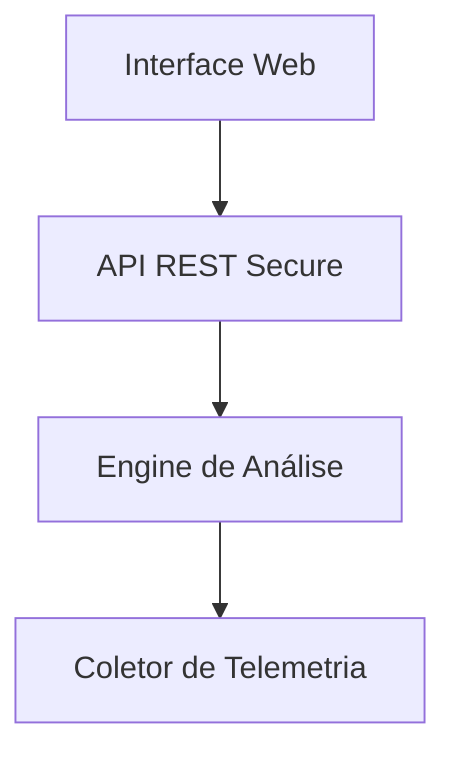

# Net Gard Pro

Net Gard Pro é um software avançado de monitoramento, segurança e gestão de redes, projetado para oferecer controle total, detecção inteligente de ameaças e automação de respostas. Ideal para empresas, equipes de TI e administradores de sistemas que buscam visibilidade completa e segurança robusta em seus ambientes de rede.

---

## Índice
- [Visão Geral](#visão-geral)
- [Principais Recursos](#principais-recursos)
- [Arquitetura do Sistema](#arquitetura-do-sistema)
- [Requisitos do Sistema](#requisitos-do-sistema)
- [Instalação](#instalação)
- [Configuração Inicial](#configuração-inicial)
- [Como Usar](#como-usar)
- [Roadmap](#roadmap)
- [Contribuindo](#contribuindo)
- [Licença](#licença)
- [Contato](#contato)

---

## Visão Geral

O Net Gard Pro foi desenvolvido para fornecer segurança avançada e monitoramento detalhado de redes corporativas. Ele combina análise inteligente, interface moderna e mecanismos de resposta automática para apoiar o trabalho de administradores em ambientes de alta demanda.

---

## Principais Recursos

### Monitoramento em Tempo Real
- Acompanhamento contínuo do tráfego de rede.
- Gráficos e métricas detalhadas sobre latência, pacotes e utilização de dispositivos.
- Identificação imediata de quedas ou picos.

### Detecção Inteligente de Ameaças
- Algoritmos de machine learning para identificar comportamentos anômalos.
- Detecção de ataques como DDoS, brute force, escaneamento suspeito e intrusões.
- Classificação de risco para priorização de incidentes.

### Automação de Respostas
- Bloqueio automático de IPs suspeitos.
- Scripts customizáveis para respostas a eventos específicos.
- Fluxos de ação baseados em políticas internas.

### Dashboard Personalizável
- Interface web moderna e responsiva.
- Widgets configuráveis.
- Relatórios e logs exportáveis.

### Alertas Inteligentes
- Notificações via e-mail, Slack, Teams ou SMS.
- Regras ajustáveis para alertas críticos, moderados e informativos.

---


## Arquitetura do Sistema


### Usando Docker (recomendado)

```bash
git clone https://github.com/sua-org/net-gard-pro.git
cd net-gard-pro
docker-compose up -d
```
### Instalação Manual

```bash
git clone https://github.com/sua-org/net-gard-pro.git
cd net-gard-pro
pip install -r requirements.txt
python manage.py migrate
python manage.py runserver
```

## Configuração Inicial

Acesse o dashboard em:
http://localhost:8000

Crie um usuário administrador.

Adicione agentes ou fontes SNMP/NetFlow.

Configure alertas e prioridades.

Personalize o dashboard conforme sua necessidade.

### Como Usar
Monitoramento

Acesse “Rede > Visão Geral” para visualizar tráfego, dispositivos e métricas.

## Incidentes de Segurança

Acesse “Segurança > Incidentes”.

Consulte a pontuação de risco de cada detecção.

Aja manualmente ou deixe a automação resolver.

## Automação

Em “Configurações > Automação”, configure regras como:

Bloqueio automático de IP após tentativas de login falhas.

Alerta quando o uso de banda exceder limites definidos.

## Relatórios

Acesse “Relatórios > Exportar” e gere arquivos para auditoria.

### Roadmap

 Aplicativo mobile

 Integração com AWS Security Hub

 Painel de compliance (ISO, LGPD)

 Módulo avançado de resposta automatizada

 Suporte a Kubernetes Network Policies

### Contribuindo

Contribuições são bem-vindas.

Faça um fork do repositório.

Crie uma branch para a sua feature.

Envie um Pull Request.

Aguarde revisão da equipe.

### Licença

Este projeto está licenciado sob a MIT License. Consulte o arquivo LICENSE para mais detalhes.

### Contato

Equipe Net Gard Pro
E-mail: contato@netgardpro.com
