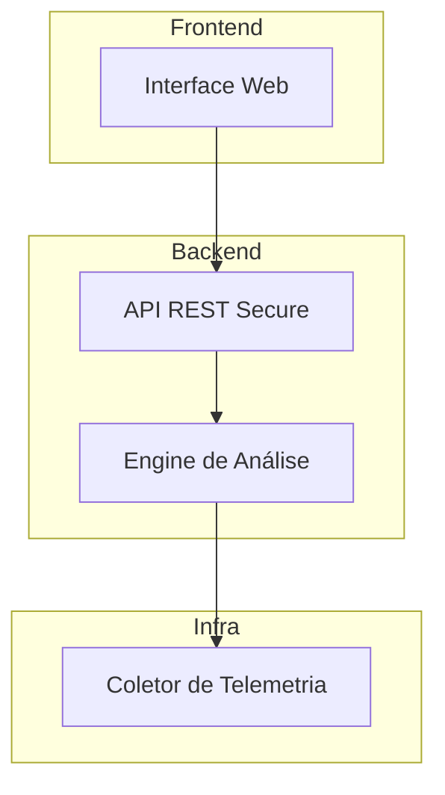

# 🛡 Net Guard Pro
**Segurança, Visibilidade e Controle para a Nossa Rede**
O **Net Guard Pro** é a nossa solução interna para garantir que a rede da empresa
permaneça rápida, segura e estável. Ele atua como um "sistema imunológico" digital,
monitorando o tráfego, bloqueando ameaças automaticamente e ajudando a equipe de TI a
dormir tranquila.
> **Para quem é este documento?**
> * **Colaboradores (Não-técnicos):** Para entender como nossa segurança funciona e como
acessar relatórios.
> * **Desenvolvedores e TI:** Para instalar, configurar e manter o sistema rodando.
---
## 📑 Índice
1. [Para Leigos: O que o Net Guard Pro faz?](#para-leigos-o-que-o-net-guard-pro-faz)
2. [Principais Recursos](#principais-recursos)
3. [Arquitetura (Visão Técnica)](#arquitetura-visão-técnica)
4. [Instalação (Apenas TI/Devs)](#instalação-apenas-tidevs)
5. [Primeiros Passos e Configuração](#primeiros-passos-e-configuração)
6. [Guia de Uso](#guia-de-uso)
7. [O Futuro (Roadmap)](#o-futuro-roadmap)
8. [Suporte](#suporte)
---
## 💡 Para Leigos: O que o Net Guard Pro faz?
Imagine que a rede da nossa empresa é um prédio comercial movimentado.
* **Monitoramento:** O Net Guard Pro é como as câmeras de segurança e a portaria. Ele vê
quem entra, quem sai e se alguém está carregando algo suspeito.
* **Detecção de Ameaças:** Se alguém tentar arrombar uma porta (ataque de força bruta) ou
se uma multidão tentar bloquear a entrada (DDoS), o sistema percebe na hora.
* **Automação:** Ele não apenas avisa; ele age. É como se as portas se trancassem
automaticamente ao detectar um ladrão, antes mesmo do segurança chegar.
---
## 🚀 Principais Recursos
### 👁 Visibilidade Total (Monitoramento)
* **Tempo Real:** Veja o que está acontecendo agora na rede.
* **Métricas Claras:** Gráficos fáceis de entender sobre velocidade e uso de dados.
* **Saúde da Rede:** Identifica se a internet está lenta ou se algum equipamento caiu.
### 🛡 Segurança Inteligente
* **IA Sentinela:** Usa Inteligência Artificial para aprender o que é "normal" e alertar sobre o
que é "estranho"
.
* **Priorização:** Classifica problemas por gravidade (Crítico, Alto, Médio), para focarmos no
que importa.
### 🤖 Resposta Automática
* **Bloqueio Imediato:** IPs maliciosos são barrados instantaneamente.
* **Regras da Casa:** O sistema segue as políticas da empresa automaticamente (ex: alertar
se alguém baixar arquivos gigantes de madrugada).
### 📊 Dashboard e Alertas
* **Interface Amigável:** Tudo acessível via navegador web.
* **Notificações:** Receba alertas onde preferir (E-mail, Slack, Teams ou SMS).
---
## 🏗 Arquitetura do Sistema

Explicação do Fluxo:
Coletor: Captura dados brutos da rede.
Engine: O "cérebro" que analisa os dados e decide se há uma ameaça.
API: A ponte segura que transporta as informações.
Interface: Onde o usuário vê os gráficos e alertas.

### 💻 Instalação (Apenas TI/Devs)
⚠ Se você não é da equipe técnica, pule para a seção "Primeiros Passos"

Pré-requisitos
Git instalado
Docker e Docker Compose (Recomendado)
Python 3.9+ (Apenas para instalação manual)
# Opção A: Via Docker (Recomendada 🐳)
A maneira mais rápida e limpa de rodar o projeto.
```Bash
# 1. Baixe o código
git clone
[https://github.com/sua-org/net-guard-pro.git](https://github.com/sua-org/net-guard-pro.git)
# 2. Entre na pasta
cd net-guard-pro
# 3. Suba os containers
docker-compose up -d
```
# Opção B: Instalação Manual
Para desenvolvimento ou ambientes sem Docker.
```Bash
git clone
cd net-guard-pro
[https://github.com/sua-org/net-guard-pro.git](https://github.com/sua-org/net-guard-pro.git)
# Instala dependências
pip install -r requirements.txt
# Configura o banco de dados
python manage.py migrate
# Inicia o servidor
python manage.py runserver
```
### 🏁 Primeiros Passos e Configuração
Após a instalação, o sistema estará acessível no seu navegador.
Acesso: Abra http://localhost:8000 (ou o IP do servidor).
Login: Utilize as credenciais de administrador criadas na instalação.
Conexão: Vá em Configurações > Fontes e adicione os dispositivos (agentes SNMP ou
NetFlow) que deseja monitorar.
Ajuste Fino: Configure os canais de notificação (ex: webhook do Slack) para não perder
nenhum alerta.

### 📖 Guia de Uso Rápido
Para verificar a saúde da rede
Vá para Rede > Visão Geral.
## O que procurar: Gráficos vermelhos ou picos repentinos de uso.
Se houver um incidente de segurança
Vá para Segurança > Incidentes.

## O que fazer: Verifique a "Pontuação de Risco"
. Se for alta, o sistema já deve ter bloqueado,
mas vale uma análise manual.
Para gerar relatórios (Gerentes/Auditores)
Vá para Relatórios > Exportar.
Você pode baixar PDFs ou planilhas para auditorias de conformidade.

### 🗺 O Futuro (Roadmap)
Estamos constantemente melhorando o Net Guard Pro. Aqui está o que vem por aí:
[ ] 📱 Aplicativo Mobile (iOS/Android)
[ ] ☁ Integração nativa com AWS Security Hub
[ ] ⚖ Painel de Compliance automático (LGPD/ISO)
[ ] 🕸 Suporte a Kubernetes Network Policies

### 🤝 Contribuindo
Quer ajudar a melhorar o código?
Faça um Fork do projeto.
Crie uma Branch para sua feature (git checkout -b feature/nova-melhoria).
Envie um Pull Request e aguarde o Code Review da equipe.

### 📞 Suporte e Contato
Dúvidas, sugestões ou encontrou um bug?
Time Técnico: Abra uma issue no GitHub ou chame no Slack #dev-netguard.
E-mail: contato@netguardpro.com

## Licença: MIT License (Software Livre).
Documentação atualizada em: Dezembro/2025
